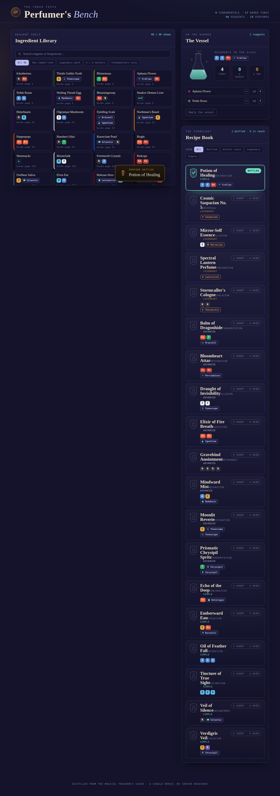
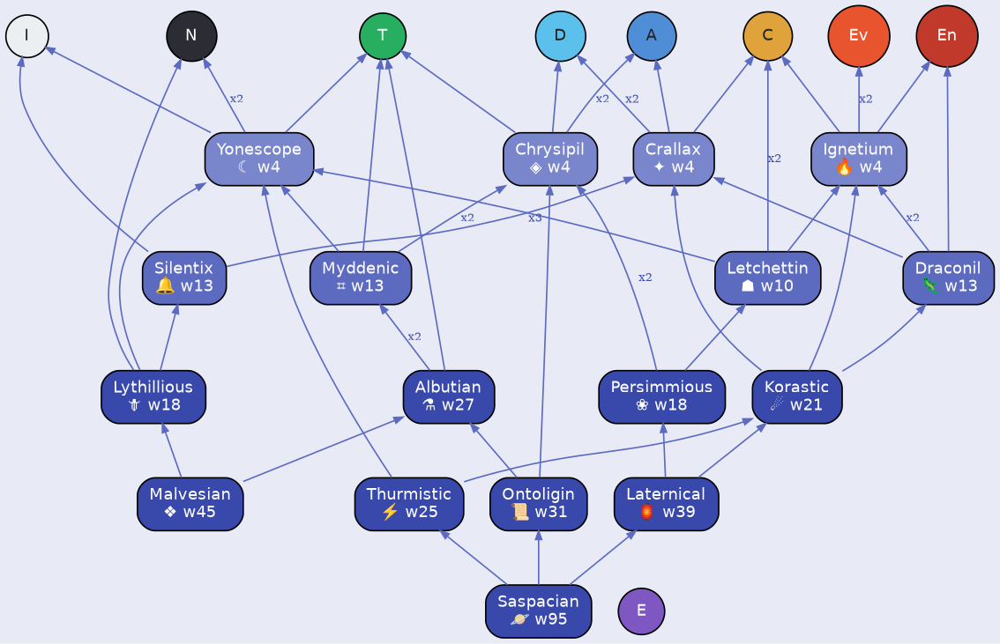

# Byobu — Three Feifs · Perfume Frequency System

This repo decodes the **Three Feifs** magical-perfume system from its two source
PDFs, represents the whole space as a graph, and ships an interactive
**Perfumer's Bench** where you combine ingredients, watch the magical frequencies
of your brew assemble, and discover which perfume recipe you've satisfied.

## What's here

| Path | What it is |
|---|---|
| **`app/index.html`** | The interactive Perfumer's Bench — a single self-contained page. **Open it in a browser** (no server needed). |
| `app/data.json` | The validated data model: 9 fundamentals, 17 named frequencies, 96 ingredients, 41 perfumes (the d40 common-recipe table; roll 16 is both Bright and Frenzy). |
| `app/build_data.py` | Reproducible build: encodes the ground truth read from the PDFs, validates it, and exports `data.json`. |
| `app/SPEC.md` | The design/build brief for the UI. |
| **`docs/SYSTEM.md`** | Full write-up of the system, the decode workflow, and every frequency / ingredient / recipe. |
| `docs/frequency_graph.png` · `.svg` | The frequency **decomposition graph**, rendered. |
| `docs/graph.json` | The entire space as one typed graph (163 nodes, 482 edges). |
| `Magical Frequencies.pdf` · `TTF Ingredients.pdf` | The original source material (ground truth). |

## The system in one minute

- A **brew** is a *multiset of frequency tokens*. Every **ingredient** emits a
  fixed set of tokens; a brew is the sum of its ingredients' emissions.
- Frequencies come in two layers: **9 fundamentals** (lettered for the D&D schools
  of magic — `A C D En Ev I N T`, plus a rare ninth `E`) and **17 named tones**,
  each of which **decomposes** into simpler ones — a DAG that climbs from raw tones
  up to the masterwork **Saspacian** (which expands to 95 fundamentals).
- A **perfume** is defined by one or more target multisets of tokens (its
  **tunings** — slashed ingredient alternatives in the source table can yield
  different profiles for the same perfume). A brew satisfies it when the brew can
  be made *exactly equal* to any tuning. The listed ingredients are just the
  *common* recipe; any ingredients hitting the same frequencies work.
- Two **wildcard markers** add control: **⊖ remove** any one token
  (Shadow Demon Liver, Ennerx Core, Sheensacks) and **⊕ add** any one token
  (Southollow Royal Tulip) — the only way to manifest the four legendary tones no
  ingredient emits.

The model is calibrated against the canonical example
(*Aphasia Flower + Noble Roses → Swana's Serum*, the healing profile) and every
one of the 41 recipes is verified craftable from its listed common ingredients.
Full details, tables, and the graph are in [`docs/SYSTEM.md`](docs/SYSTEM.md).

## The frequency graph

## Run / rebuild

- **Use it:** open `app/index.html` in any modern browser.
- **Rebuild the data from the ground truth:** `cd app && python3 build_data.py`
  (needs `pymupdf`; validates everything and re-exports `data.json`).
